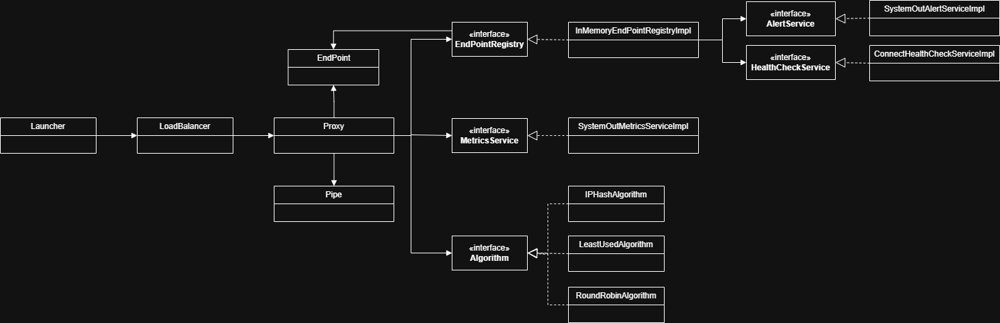

# Load Balancing Like It's 1999

## Introduction
This project seeks to provide a solution to the problem statement below.  It was implemented over the course of a 72 hour period between 18th - 20th September 2025.

### Problem Statement
It’s 1999.  You, are a software engineer working at a rapidly growing scale-up.

The company has outgrown its start-up era, single server setup.  Things are starting to fail rapidly.  You are tasked with designing and building a software-based load balancer to allow multiple machines to handle the load.

The task is to implement a basic, software-based load-balancer, operating at layer 4.

#### Requirements
 -	It can accept traffic from many clients
 -	It can balance traffic across multiple backend services
 -	It can remove a service from operation if it goes offline
 
#### Optional Requirements
 - It should follow best practice software engineering principles including:
     - [SOLID](https://en.wikipedia.org/wiki/SOLID)
     - [DRY](https://en.wikipedia.org/wiki/Don%27t_repeat_yourself)
 - It should support the ability to use a number of load balancing algorithms
 - It should support additional non-functional requirements including being:
     - Scalable - the solution should support:
         - The ability to add new backend services dynamically
         - The ability to add new instances of the load balancer for horizontal scaling
     - Performant - the solution should be lightweight and make efficient use of resources
     - Reliable - the solution should provide consistent results and be well tested
     - Highly Available - the solution should be fault tolerant and have a high up time
     - Observable - the solution should support monitoring
     - Maintainability - the solution should be designed such that bugs can be easily resolved
     - Extensible - the solution should be designed such that additional functionality can be easily added
     
## Definitions
### Layer 4 Software-Based Load Balancer
A layer 4 software load balancer directs traffic at the Transport Layer of the OSI model, distributing requests based on network information like source and destination IP addresses and ports for TCP and UDP protocols
 
## Assumptions
The following assumptions have been made during the implementation:

- Only TCP/IP is required to be supported
- SSL/TLS is not required to be supported
- Only Java Version 1.2 (a.k.a Java 2) features and functionality may be used
- Frameworks such as Spring etc were unavailable in 1999 so cannot be used

## Enhancements
Due to time constraints the following enhancements were not implemented, but should be noted as avenues for further work:

- Scalability: 
    - To scale horizontally a distributed caching mechanism should be used to manage end points
    - The ability to register/deregister endpoints without needing to stop the load balancer is necessary to support high availabilty
- Performance:  
    - To improve performance Thread pooling should be used to avoid the overhead of instantiating a new Thread for each request
    - Batching of messages to the AlertService and MetricsService
    - Use of non-blocking IO
    - Synchronized blocks may become bottlenecks.  In later versions of Java additional concurrency features would help resolve this eg: `ReentrantReadWriteLock`.
- Fault Tolerance:
    - Load balancers can represent a single point of failure so supporting clusters of load balancers is crucial
    - Should the LoadBalancer fail it should automatically attempt to restart a configurable number of times
    - Implementation of a Circuit Breaker
    - Implementation of rate limiting (ie: back-pressure/Bulkhead) to prevent overloading of backend services
- Alerting: a production ready solution should support appropriate alerting (eg: email, SMS etc) so that any issues are actively reported to 

## Architecture Overview
The diagram below illustrates the main classes and their relationships in the implemented solution.


### Main Components
- **Launcher**: Entry point for starting the load balancer.
- **LoadBalancer**: Core class that listens for client connections and initiates proxies to handle them.
- **Proxy**: Handles each client connection, selects a backend, and pipes data between client and backend.
- **Algorithm**: Interface for load balancing algorithms (e.g., RoundRobin, IPHash).
- **EndPointRegistry**: Manages backend endpoints, health checks, and failure notifications.
- **AlertService**: Sends alerts on endpoint failures and recoveries.
- **MetricsService**: Sends metrics on connection performance for monitoring purposes.
- **HealthCheckService**: Determines the health of end points.

## How to Launch

### Prerequisites
- Java 8 or higher
- Compiled classes (see `bin/` directory)

### Build (if needed)
If you have source code only, compile with:

```
javac -d bin src/com/neil/harvey/loadbalancer/**/*.java
```

### Run the Load Balancer

From the `v1999` directory, run:

```
java -cp bin com.neil.harvey.loadbalancer.Launcher <listenPort> <endpoints> <algorithm> <timeToLive>
```

#### Arguments:
- `listenPort`: Port for the load balancer to listen on (1-65535)
- `endpoints`: Comma-separated list of backend endpoints in the form `host:port` (e.g., `127.0.0.1:9001,127.0.0.1:9002`)
- `algorithm`: Load balancing algorithm to use (`RoundRobin` or `IPHash`)
- `timeToLive`: Health check interval in milliseconds (e.g., `5000`)

#### Example:

```
java -cp bin com.neil.harvey.loadbalancer.Launch 8080 127.0.0.1:9001,127.0.0.1:9002 RoundRobin 5000
```

This will start the load balancer on port 8080, forwarding connections to two backends using the Round Robin algorithm, with health checks every 5 seconds.

## Notes
- Alerts are printed to the console by default (see `SystemOutAlertServiceImpl`).
- Metrics are printed to the console by default (see `SystemOutMetricsServiceImpl`).
